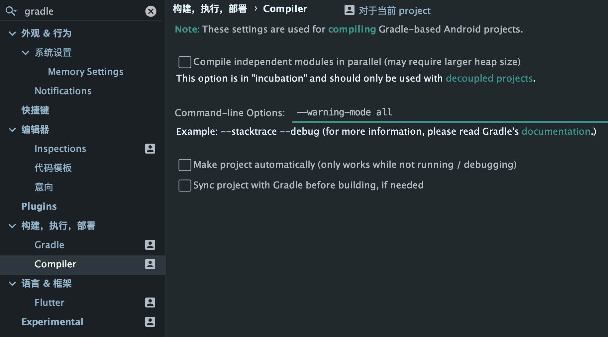

🐛 Android Studio Bug 日志记录
=======================================================

🦠 > couldn't find "libflutter.so"
-------------------------------------------------------

```log
E/AndroidRuntime: FATAL EXCEPTION: main
Process: com.x.y, PID: 6959
```
❌未解决

🦠 > Installation did not succeed.
-------------------------------------------------------

```log
Installation did not succeed.
The application could not be installed.  

Session 'android.app': Installation did not succeed. The application could not be installed. Retry

Session 'android.app': Installation did not succeed. 
The application could not be installed: INSTALL_FAILED_CONFLICTING_PROVIDER Retry
```

✅已解决  
● 清理项目   
● 重构项目  
● 清理编辑器缓存  
● 删除 .idea  
● 卸载app  
● 修改包名  

🦠 > Deprecated Gradle features were used in this build
--------------------------------------------------------

```log
Deprecated Gradle features were used in this build, making it incompatible with Gradle 7.0.
Use '--warning-mode all' to show the individual deprecation warnings.
```

✅已解决  
● 打开Android Studio 设置   
● 搜索 gradle  
● 点击构建，执行，部署下的Compiler  
● 添加一行命令参数 --warning-mode all  
> 

🦠 >
---------------------------------------------------------


