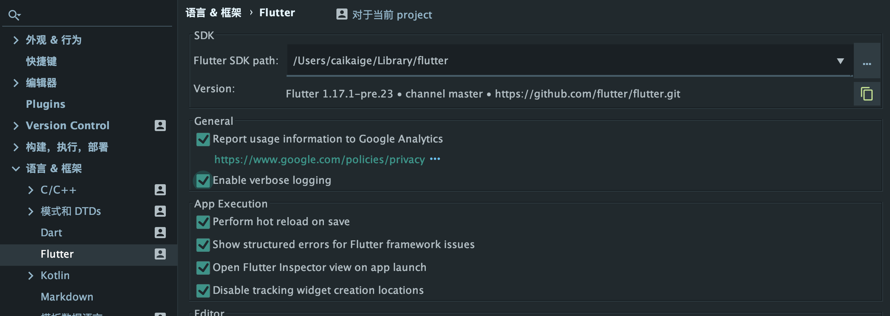

环境配置  
国内仓库地址:  
export PUB_HOSTED_URL=https://pub.flutter-io.cn  
export FLUTTER_STORAGE_BASE_URL=https://storage.flutter-io.cn


● web:
flutter channel master | dev
flutter config --enable-web
flutter create .
flutter run -d chrome

● desktop:
flutter channel master
flutter config --enable-macos-desktop
flutter config --enable-windows-desktop
flutter config --enable-linux-desktop

flutter create --macos .
flutter create --windows .
flutter create --linux .

import 'package:flutter/foundation.dart'
void main() {
  debugDefaultTargetPlatformOverride = TargetPlatform.fuchsia;
  [...]
}

flutter run -d \<device-name> 

🦠 错误日志
========================================================
● Duplicate GlobalKey detected in widget tree
```log
Duplicate GlobalKey detected in widget tree.
```
❌未解决

--------------------------------------------------------
● Flutter SDK not found. 
```log
Define location with flutter.sdk in the local.properties file
A problem occurred evaluating project ':app'.
> Flutter SDK not found. Define location with flutter.sdk in the local.properties file.
```
✅解决  
> 打开Android Studio 设置 > 搜索flutter >  
> 修改路径 > 打开local.properties > 在底下输入      
> flutter.sdk=/Users/caikaige/Library/flutter    
> 如图所示   


--------------------------------------------------------

● No version of NDK matched the requested version 20.0
```log
Execution failed for task ':app:stripDebugDebugSymbols'.
> No version of NDK matched the requested version 20.0.5594570. Versions available locally: 21.1.6273396-rc2, 21.1.6273396-rc2
```
✅解决  
> 打开Android Studio 项目配置  
> 修改ndk路径为Android SDK下的ndk-bundle

--------------------------------------------------------

● Failed to setup Skia Gr context.
```log
E/flutter ( 5357): [ERROR:flutter/shell/gpu/gpu_surface_gl.cc(70)] Failed to setup Skia Gr context.
```

✅解决  
flutter run --enable-software-rendering  

--------------------------------------------------------

● Could not initialize class org.codehaus.groovy.classgen.Verifier
```log
Could not open cp_init generic class cache for initialization script '/private/var/folders/f6/g9zndyzj1436nr5qv7jw52ym0000gn/T/sync.studio.tooling4.gradle' (/Users/caikaige/.gradle/caches/5.6.2/scripts/cg5i13a3a040rl48i54mided2/cp_init/cp_init40e7ec637808a9c747559d26950b1d9b).
> Could not initialize class org.codehaus.groovy.classgen.Verifier
```
✅解决  
> Gradle版本低与6.x 无法配合JDK14  
> 修改gradle版本为6.0以上

--------------------------------------------------------


● E/Trace: error opening trace file: Permission denied (13)
```log
E/Trace: error opening trace file: Permission denied (13)
```
✅解决  
> flutter run --enable-software-rendering  

--------------------------------------------------------

● java.lang.NoClassDefFoundError: io.flutter.embedding.engine.loader.FlutterLoader
```log
E/AndroidRuntime: FATAL EXCEPTION: main
    java.lang.NoClassDefFoundError: io.flutter.embedding.engine.loader.FlutterLoader
        at io.flutter.view.FlutterMain.startInitialization(FlutterMain.java:48)
        at io.flutter.app.FlutterApplication.onCreate(FlutterApplication.java:24)
        at android.app.Instrumentation.callApplicationOnCreate(Instrumentation.java:999)
        at android.app.ActivityThread.handleBindApplication(ActivityThread.java:4151)
        at android.app.ActivityThread.access$1300(ActivityThread.java:130)
        at android.app.ActivityThread$H.handleMessage(ActivityThread.java:1255)
        at android.os.Handler.dispatchMessage(Handler.java:99)
        at android.os.Looper.loop(Looper.java:137)
        at android.app.ActivityThread.main(ActivityThread.java:4745)
        at java.lang.reflect.Method.invokeNative(Native Method)
        at java.lang.reflect.Method.invoke(Method.java:511)
        at com.android.internal.os.ZygoteInit$MethodAndArgsCaller.run(ZygoteInit.java:786)
        at com.android.internal.os.ZygoteInit.main(ZygoteInit.java:553)
        at dalvik.system.NativeStart.main(Native Method)
```


● 标题
```log
xxx
```
✅解决  
❌未解决


● 标题
```log
xxx
```
✅解决  
❌未解决